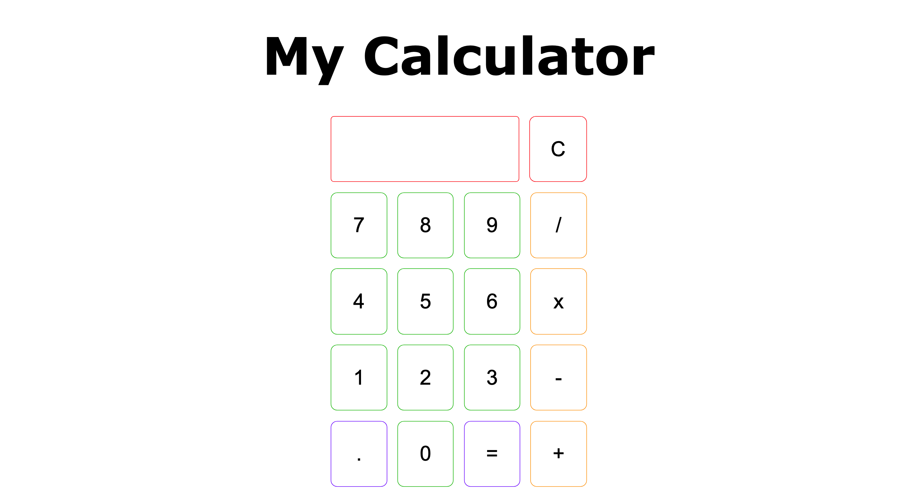

# Calculator Project

This project is a simple web-based calculator that allows users to perform basic arithmetic operations such as addition, subtraction, multiplication, and division. The calculator has a clean interface with a main display for results and a secondary display for tracking the calculation process.

## Screenshot


## Features
- Perform basic arithmetic operations: Addition, Subtraction, Multiplication, and Division.
- Supports decimal numbers up to six decimal points for accuracy.
- Prevents division by zero with an "ERROR" message.
- Clear button to reset the calculator's state.
- Dynamic display updates for improved user experience.

## Technologies Used
- **HTML** for the structure of the web application.
- **CSS** for styling the calculator interface.
- **JavaScript** for implementing the calculator's functionality and logic.

## Installation
To run this project locally, follow these steps:

1. Clone this repository:
   ```bash
   git clone git@github.com:miihirr/Calculator.git
   ```
2. Navigate to the project directory:
   ```bash
   cd calculator-project
   ```
3. Open the `index.html` file in your preferred browser.

## Usage
- Click on the numeric buttons to enter values.
- Use the arithmetic operators (+, -, x, /) to perform calculations.
- Click the `=` button to evaluate the expression.
- Use the `C` (Clear) button to reset the calculator.
